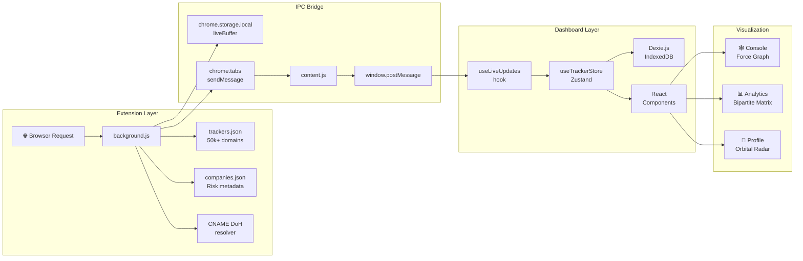

<div align="center">

<br>

<picture>
  <source media="(prefers-color-scheme: dark)" srcset="dashboard/public/logo512.png">
  <source media="(prefers-color-scheme: light)" srcset="dashboard/public/logo512.png">
  
</picture>

<br><br>

# expos<!--  -->.ed

**They watch you. Now watch them.**

<br>

<p align="center">
  <a href="https://exposed-dashboard.vercel.app"></a>&nbsp;
  <a href="https://github.com/Ns81000/Exposed"></a>&nbsp;
  <a href="./LICENSE"></a>
</p>

<br>

<p>
  &nbsp;
  &nbsp;
  &nbsp;
  &nbsp;
  &nbsp;
  &nbsp;
  
</p>

<br>

<sub>Local-first · Zero cloud · Open source · Decentralized surveillance intelligence</sub>

</div>

<br>

---

<br>

> **`uBlock Origin hides them. expos.ed names, unmasks, and analyzes them.`**

Most privacy tools block trackers silently — keeping you safe but blind. You never see *who* is watching, *what* data they're siphoning, or *how* they bypass your defenses.

**expos.ed** flips the paradigm: it captures surveillance in real-time, decrypts the payloads, maps the corporate network behind it, and renders the entire threat landscape as an interactive intelligence dashboard — all without a single byte leaving your machine.

<br>

<div align="center">

| 🔬 Intercept | 🧬 Analyze | 🗺️ Visualize |
|:---:|:---:|:---:|
| Real-time network request capture with payload decryption | DNS CNAME de-cloaking, fingerprint heuristics, PII classification | D3.js force graphs, orbital radar maps, bipartite matrices |

</div>

<br>

---

<br>

## ⚡ Platform Architecture

<br>

expos.ed is a two-component system that operates entirely within the browser sandbox:

<br>

```
┌─────────────────────────────────────────────────────────────────────────┐
│                         BROWSER CONTEXT                                │
│                                                                        │
│  ┌───────────────────────────┐    ┌──────────────────────────────────┐ │
│  │   CHROME EXTENSION        │    │   REACT DASHBOARD                │ │
│  │   ─────────────────       │    │   ────────────────               │ │
│  │                           │    │                                  │ │
│  │   background.js           │    │   Console View                   │ │
│  │   ├─ webRequest intercept │    │   ├─ D3 force-directed graph     │ │
│  │   ├─ CNAME DoH resolver   │◀──▶│   ├─ Visit timeline             │ │
│  │   ├─ Payload decoder      │IPC │   ├─ Fingerprint alerts          │ │
│  │   └─ Blocklist compiler   │    │   └─ Privacy scoring engine      │ │
│  │                           │    │                                  │ │
│  │   content.js + main.js    │    │   Threat Analytics               │ │
│  │   ├─ Canvas sensor        │    │   ├─ Bipartite contamination map │ │
│  │   ├─ WebGL sensor         │    │   ├─ Bandwidth leak timeline     │ │
│  │   ├─ Audio sensor         │    │   └─ Exfiltration classification │ │
│  │   ├─ WebRTC sensor        │    │                                  │ │
│  │   └─ Keylogger sensor     │    │   Shadow Profile                 │ │
│  │                           │    │   ├─ Orbital persona radar       │ │
│  │   trackers.json (50k+)    │    │   ├─ Live telemetry ledger       │ │
│  │   companies.json          │    │   └─ De-anonymization scoring    │ │
│  │                           │    │                                  │ │
│  └───────────────────────────┘    └──────────────────────────────────┘ │
│                                                                        │
│              ┌─────────────────────────────────┐                       │
│              │   IndexedDB via Dexie.js        │                       │
│              │   All data stored locally        │                       │
│              │   No cloud. No accounts.         │                       │
│              └─────────────────────────────────┘                       │
└─────────────────────────────────────────────────────────────────────────┘
```

<br>

---

<br>

## 🔮 Intelligence Capabilities

<br>

### 🔗 DNS-over-HTTPS CNAME De-cloaking

Trackers hide behind first-party subdomains to bypass blocklists. expos.ed resolves CNAME chains using Cloudflare's secure DoH API:

```
analytics.yourbank.com  →  CNAME  →  metrics.adobe.com
     "First-party"                      Exposed!
```

Every cloaked tracker is flagged as `Company (Cloaked)` in the timeline with full chain visibility.

<br>

### 🧬 Behavioral Fingerprint Sensors

Injected into the `MAIN` world, expos.ed instruments browser prototype APIs to catch scripts building hardware profiles:

| Sensor | API Monitored | Detection Method |
|:--|:--|:--|
| **Canvas** | `toDataURL`, `getImageData` | Prototype override trapping |
| **WebGL** | `getParameter` (GPU queries) | Parameter interception |
| **Audio** | `createOscillator` | AudioContext monitoring |
| **WebRTC** | `createOffer` (local IP leak) | RTCPeerConnection hook |
| **Keylogger** | `keydown`, `keypress`, `change` | High-frequency listener detection |

Each detection includes the full **JavaScript call stack** for forensic tracing.

<br>

### 🔍 Real-Time Payload Inspection

Every intercepted request is decoded and classified:

```
POST  →  tracker.facebook.com/tr
         ├─ PII:          email, user_id, profile_name
         ├─ Fingerprint:  screen_width, platform, user_agent
         ├─ Behavior:     scroll_depth, click_x, key_count
         └─ Marketing:    utm_source, fbclid, gclid
```

Payloads are parsed from URL query strings, JSON bodies, and NDJSON/Sentry envelopes — then formatted into searchable key-value grids with **2,800+ parameter classifiers**.

<br>

### 🛡️ Dynamic Blocker Shield

An opt-in high-performance blocking engine built on Chrome's `declarativeNetRequest` API:

- **50,000+** compiled tracking domains from uBlock Origin filter lists
- CNAME-aware blocking that catches cloaked vectors
- Real-time `Blocked` / `Allowed` status per request
- Shield protection bonus reduces privacy score penalties

<br>

### 📊 Privacy Scoring Engine

Every site receives an algorithmic privacy grade calculated in real-time:

```
Score: 100 (start)
  ├─ High-risk tracker (allowed):     -15 pts
  ├─ Medium-risk tracker (allowed):    -5 pts
  ├─ Low-risk tracker (allowed):       -2 pts
  ├─ Active fingerprinting detected:  -25 pts
  ├─ High-risk tracker (blocked):      -3 pts  ← shield bonus
  └─ Medium-risk tracker (blocked):    -1 pts  ← shield bonus

Grade Scale: A (90-100) → B (80-89) → C (70-79) → D (55-69) → F (0-54)
```

<br>

---

<br>

## 🖥️ Three Dashboard Views

<br>

<table>
<tr>
<td width="33%" align="center">

### Console

**Real-Time Surveillance Monitor**

- D3 force-directed network graph
- Chronological visit timeline
- Fingerprint alert panel
- Tracker detail inspector
- Live privacy grade scoring

</td>
<td width="33%" align="center">

### Threat Analytics

**Cross-Site Intelligence**

- Bipartite contamination matrix
- Bandwidth savings area chart
- Exfiltration vector classification
- Company threat breakdown
- Protection rate metrics

</td>
<td width="33%" align="center">

### Shadow Profile

**Digital Persona Reconstruction**

- Orbital radar visualization
- Identity de-anonymization scoring
- Live telemetry ledger (paginated)
- Company node inspection
- Searchable parameter database

</td>
</tr>
</table>

<br>

---

<br>

## 🏗️ Technical Stack

<br>

<div align="center">

| Layer | Technology | Purpose |
|:--|:--|:--|
| **Extension Runtime** | Manifest V3 Service Worker | Network interception, CNAME resolution, blocker engine |
| **Fingerprint Sensors** | Content Script + `MAIN` world injection | Browser API prototype overrides |
| **Frontend Framework** | React 18.3 + Vite 5.4 | Component architecture with HMR |
| **State Management** | Zustand 5.0 | Reactive global store with DB bridge |
| **Data Persistence** | Dexie.js 4.0 (IndexedDB) | Local-first structured storage |
| **Visualization** | D3.js 7.9 | Force simulation, area charts, bipartite graphs |
| **Styling** | Tailwind CSS 3.4 | Linear × Raycast fusion design system |
| **Typography** | Inter + JetBrains Mono + Outfit | Display, body, and monospace hierarchies |
| **IPC Bridge** | `window.postMessage` | Extension ↔ Dashboard communication |
| **DNS Resolution** | Cloudflare DoH JSON API | Async CNAME unmasking |

</div>

<br>

### Design System

The UI is built on a custom **Linear × Raycast** fusion design language:

```css
--color-bg:          #010102     /* Deep black canvas            */
--color-surface-1:   #0f1011     /* Primary surface              */
--color-surface-2:   #141516     /* Elevated surface             */
--color-accent:      #5e6ad2     /* Primary lavender             */
--color-risk-high:   #ff6161     /* Threat — critical            */
--color-risk-medium: #ffc533     /* Threat — elevated            */
--color-risk-low:    #59d499     /* Threat — nominal             */
--color-success:     #59d499     /* Shield protection            */
```

Glass panels with `backdrop-blur`, hairline borders, radar sweep animations, and monospace tactical labels.

<br>

---

<br>

## 💾 Data Architecture

<br>

All telemetry is stored exclusively in **IndexedDB** on your local device via Dexie.js:

```
ExposedDB
├── sites             PK: domain        ← Visited hostnames
├── visits            PK: visitId       ← Page session records
├── trackerEvents     PK: ++id          ← Network intercept logs
│                     IDX: [visitId+requestUrl], company, risk, size
├── fingerprintEvents PK: ++id          ← API profiling attempts
│                     IDX: visitId, api, siteDomain
└── archives          PK: date          ← Compressed daily snapshots
```

- **Auto-archiving** compresses daily summaries for long-term retention
- **Configurable TTL** with automatic session expiry (default: 7 days)
- **Full transparency** — inspect all data via DevTools → Application → IndexedDB

<br>

---

<br>

## 🔒 Security & Privacy Principles

<br>

<table>
<tr>
<td width="25%" align="center">

**Zero Cloud**

No APIs, no servers,
no databases.
Everything runs on
your hardware.

</td>
<td width="25%" align="center">

**Zero Telemetry**

expos.ed never logs
usage metrics, crash
reports, or domain
lists to anyone.

</td>
<td width="25%" align="center">

**Zero Accounts**

No signup, no email,
no password. Install
and start auditing
immediately.

</td>
<td width="25%" align="center">

**Full Auditability**

Open source code.
Zero binaries. Zero
minified wrappers.
Inspect every line.

</td>
</tr>
</table>

<br>

> Perfect for **GDPR/CCPA compliance audits**, behavioral adware investigation, and documenting tracker behavior as forensic evidence.

<br>

---

<br>

## 🚀 Getting Started

<br>

### Prerequisites

- **Google Chrome** (or Chromium-based: Edge, Brave, Opera, Arc)
- **Node.js 18+**
- **pnpm** package manager

<br>

### 1 · Clone the repository

```bash
git clone https://github.com/Ns81000/Exposed.git
cd Exposed
```

### 2 · Install dashboard dependencies

```bash
cd dashboard && pnpm install
```

### 3 · Load the Chrome Extension

```
chrome://extensions  →  Enable Developer mode  →  Load unpacked  →  Select extension/ folder
```

### 4 · Launch the dashboard

```bash
pnpm dev
```

Dashboard serves at **`http://localhost:5173`**

Or use the deployed version → [**exposed-dashboard.vercel.app**](https://exposed-dashboard.vercel.app/)

<br>

### 5 · Browse and observe

Open any website in a new tab. Return to the dashboard. Tracker data populates in real-time.

<br>

---

<br>

## 📂 Project Structure

<br>

```
exposed/
├── extension/                          Chrome Extension (Manifest V3)
│   ├── manifest.json                  Schema, permissions, content script config
│   ├── background.js                  Service Worker — intercept, decode, resolve CNAME
│   ├── content.js                     Content script — message bridge to dashboard
│   ├── main.js                        MAIN world — fingerprint prototype overrides
│   ├── popup.html / popup.js          Extension popup indicator
│   ├── data/
│   │   ├── trackers.json             50k+ compiled tracker domains
│   │   └── companies.json            Company metadata & risk classifications
│   └── icons/                         Extension icons (16/48/128px)
│
└── dashboard/                          React SPA (Vite)
    ├── index.html                     Entry point
    ├── vite.config.js                 Build configuration
    ├── tailwind.config.js             Linear × Raycast design tokens
    ├── vercel.json                    Deployment routing
    ├── public/
    │   ├── logo512.png               Fin brand icon
    │   └── favicon.png               Browser favicon
    └── src/
        ├── main.jsx                   React DOM bootstrapper
        ├── App.jsx                    Route controller (Landing ↔ Dashboard)
        ├── components/
        │   ├── Landing.jsx           Marketing landing page
        │   ├── Dashboard.jsx          Console orchestrator (3 views)
        │   ├── NodeGraph.jsx          D3 force-directed network graph
        │   ├── ThreatAnalytics.jsx   Cross-site intelligence panel
        │   ├── ProfileMap.jsx         Shadow profile orbital radar
        │   ├── Sidebar.jsx            Navigation & site archive list
        │   ├── SummaryStats.jsx       Privacy grades & stat cards
        │   ├── VisitTimeline.jsx      Chronological event log
        │   ├── TrackerDetailPanel.jsx Decoded payload inspector
        │   ├── FingerprintPanel.jsx   Fingerprint alert & stack traces
        │   ├── SettingsModal.jsx      TTL config & blocker toggle
        │   ├── BrandIcon.jsx          Fin SVG icon component
        │   ├── BrandLogo.jsx          "expos.ed" wordmark component
        │   ├── ConnectPrompt.jsx      Extension connection screen
        │   ├── MobileGate.jsx         Desktop-only gate
        │   ├── Toast.jsx              Notification system
        │   └── ThemeProvider.jsx      Theme context
        ├── hooks/
        │   ├── useTrackerStore.js    Zustand store (Dexie.js bridge)
        │   └── useLiveUpdates.js      Extension postMessage receiver
        ├── db/
        │   └── schema.js              IndexedDB schema (v1 → v3 migrations)
        ├── styles/
        │   └── globals.css            Design system tokens & animations
        └── utils/
            ├── archiver.js            Daily archiver & TTL cleanup
            └── riskColor.js           Risk level color mapping
```

<br>

---

<br>

## 🔄 Data Flow

<br>



<br>

---

<br>

## 🤝 Contributing

<br>

1. **Fork** the repository and branch from `main`
2. **Code** — keep components modular, follow the existing Linear × Raycast design language
3. **Build** — verify with `cd dashboard && pnpm build` (zero warnings)
4. **Submit** a Pull Request with description, testing notes, and screenshots

<br>

---

<br>

## 📄 License

Open-source under the **MIT License** — see [LICENSE](./LICENSE) for details.

<br>

---

<br>

<div align="center">

<picture>
  <source media="(prefers-color-scheme: dark)" srcset="dashboard/public/favicon.png">
  <source media="(prefers-color-scheme: light)" srcset="dashboard/public/favicon.png">
  
</picture>

<br><br>

**expos<!--  -->.ed** — Local-first surveillance intelligence.

<sub>See every tracker. Understand every payload. Trust no cloud.</sub>

<br><br>

[Live Demo](https://exposed-dashboard.vercel.app/) · [Report Issue](https://github.com/Ns81000/Exposed/issues) · [Source Code](https://github.com/Ns81000/Exposed)

</div>
