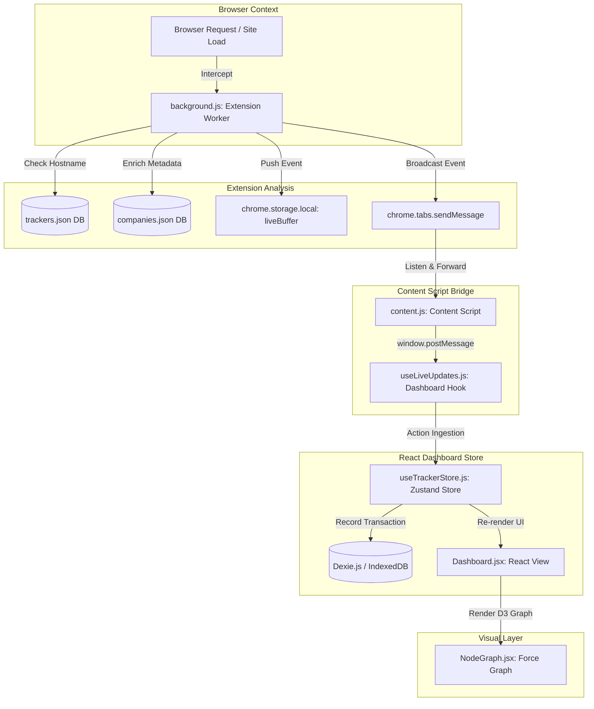

# 🚨 Exposed

<div align="center">

> **"uBlock Origin hides them. Exposed names, unmasks, and analyzes them."**

[](./LICENSE)
[](https://developer.chrome.com/docs/extensions)
[](https://react.dev)
[](https://vite.dev)
[](https://tailwindcss.com)
[](https://d3js.org)

Exposed is a local-first, decentralized privacy-intelligence platform that intercepts, visualizes, and audits the hidden tracking networks active on every website you visit. 

[Explore Architecture](#-architecture-&-data-flow) • [How to Run](#-quick-start) • [Database Schema](#-database-&-storage-layer) • [Security Policy](#-security-&-privacy-first)

</div>

---

## 📖 What is Exposed?

Most modern privacy tools (like uBlock Origin, Brave, or AdBlock) block trackers silently. While this keeps you safe, it keeps you in the dark about who is actively trying to surveil you, what data they are capturing, and how they bypass your browser settings.

**Exposed takes the opposite approach: capture the surveillance, inspect the payloads, and visualize the threat landscape.**

Two tightly integrated components work together:
1. **Chrome Extension (Sensor Layer)**: Intercepts network requests in real-time, inspects payload data, unmasks DNS CNAME cloaks, and injects behavioral sensors to trap browser fingerprinting attempts.
2. **React Dashboard (Visualization Layer)**: Renders a comprehensive dark-mode console displaying D3 force-directed networks, visit timelines, parsed exfiltration grids, and detailed profiling alerts.

> [!IMPORTANT]
> **Why Exposed is a Vital Tool for Cybersecurity Professionals & Privacy Engineers**
> * **Behavioral Adware & Spyware Auditing**: Instantly detect if embedded scripts are registering silent keyboard listeners (keyloggers), capturing inputs, or profiling system canvas/WebGL/Audio runtimes.
> * **DNS CNAME De-cloaking**: De-cloak tracking assets hiding behind masqueraded first-party subdomains to identify evasion tactics and blocklist bypasses.
> * **Payload Exfiltration Analysis**: Inspect exact query parameters and POST bodies in real time to document *what* PII (Personally Identifiable Information), session IDs, or device footprints are being leaked.
> * **GDPR/CCPA Compliance Audits**: Verify compliance standards on web applications by exporting self-contained, interactive HTML report files as auditable proof of tracker behaviour.

---

## ✨ Advanced Features

### 🔍 Real-Time Request Payload Decryption
Captures query parameters and POST body JSON data in real-time. If a tracker exfiltrates tracking identifiers, device dimensions, or session IDs, Exposed decodes them and formats them into an easy-to-read key-value grid.

### 🔗 DNS-over-HTTPS CNAME Unmasking
Trackers frequently hide behind "first-party" subdomains (e.g. `analytics.yourbank.com` pointing to `metrics.adobe.com`) to bypass browser blocklists. Exposed runs asynchronous CNAME DNS resolution queries using Cloudflare's secure JSON DNS-over-HTTPS (DoH) API, catching and flagging cloaked trackers as `Company (Cloaked)` in the timeline.

### ⚙️ Behavioral Fingerprint Sensors
Instruments browser prototype interfaces to detect scripts trying to build hardware and network profiles of you. Exposed logs and shows JavaScript call stacks for:
* **Canvas Profiling**: Calls to `toDataURL` and `getImageData`.
* **WebGL Identifiers**: Queries to `getParameter` querying graphics rendering units.
* **Audio Fingerprinting**: Creating custom audio oscillators via `createOscillator`.
* **WebRTC Leaks**: Initiating WebRTC peer connections via `createOffer` to find local IP addresses.
* **Input Capture Heuristics**: Recording keyloggers registering high-frequency keyboard (`keydown`, `keypress`) or change handlers on sensitive input elements.

### 🛡️ Dynamic Blocker Shield (Opt-In)
Equipped with an interactive togglable blocker. Built on Chrome's high-performance `declarativeNetRequest` API, when enabled, it intercepts and drops network requests matching 50,000+ compiled tracking domains and CNAME vectors, showing you a red **Blocked** status.

### 📊 D3.js Force-Directed Tracker Network
Visualizes trackers as interactive node-graph relationships. It features dynamic zoom/drag controls, risk level node coloring, and responsive layout adjustments (such as fullscreen modes). It is highly optimized to prevent render flickering or simulation restarts when background bandwidth data updates.

### 🏆 Privacy Scoring & Grading Engine
Evaluates visited sites, subtracting points based on tracking activity:
* **Risk Levels**: Allowed High-Risk trackers subtract `-15` points, Medium-Risk subtract `-5`, Low-Risk subtract `-2`.
* **Fingerprint Penalties**: Active fingerprinting attempts trigger a heavy `-25` points deduction.
* **Blocker Coverage**: Blocked trackers only carry a minor penalty (`-3` for high risk, `-1` for medium risk).
* **Grades**: Scores scale from 0 to 100, mapped to descriptive safety grades (A, B, C, D, F) and colored accordingly.

### 📂 Standalone Offline HTML Reports
Enables downloading complete, interactive reports of site analyses. The exported reports are beautifully designed in dark mode, containing summary stats, tabbed views, search filters, and collapsible grids displaying query parameters and call stacks—completely functional without internet access.

---

## 🌳 Architecture & Data Flow

Exposed operates fully inside the browser sandbox, separating intercept telemetry from state management and database writes. Below is the data pipeline visual:



---

## 📁 Directory Structure

```
exposed/
│
├── extension/                      # Chrome Extension (Manifest V3)
│   ├── manifest.json              # Extension schema, rules, and permissions
│   ├── background.js              # Service Worker - unmasks CNAME, captures payloads, compiles blocklists
│   ├── content.js                 # Content script - hooks API calls, relays tab message bridges
│   ├── main.js                    # Injected script - overrides prototype APIs to catch fingerprinting
│   ├── popup.html / popup.js       # Popup connection indicator
│   ├── data/
│   │   ├── trackers.json          # Compiled uBlock tracker domains list
│   │   └── companies.json         # Company meta metadata & risk level metrics
│   └── icons/                     # Generated extension icons (16/48/128px)
│
└── dashboard/                      # React SPA Dashboard (Vite)
    ├── index.html                 # HTML entry point
    ├── vite.config.js             # Vite compiler rules
    ├── tailwind.config.js          # Design system theme classes
    ├── package.json               # Frontend dependencies
    ├── public/                    # Favicons and brand graphics
    └── src/
        ├── main.jsx               # React DOM bootstrapper
        ├── App.jsx                # UI Router (Landing Page <-> Dashboard Console)
        ├── components/
        │   ├── Landing.jsx        # Dashboard landing page
        │   ├── Dashboard.jsx       # Main console orchestrator
        │   ├── MobileGate.jsx      # Mobile display blocker (Desktop Optimized)
        │   ├── NodeGraph.jsx       # D3 Force-Directed Network Graph
        │   ├── Sidebar.jsx         # Site navigation menu & daily archives
        │   ├── VisitTimeline.jsx   # Visited pages tracker chronology
        │   ├── TrackerDetailPanel.jsx # Decoded HTTP parameter & payload grids
        │   ├── FingerprintPanel.jsx  # Fingerprint heuristic alerts & stack traces
        │   ├── SettingsModal.jsx   # Retention configurations & blocker toggles
        │   ├── SummaryStats.jsx    # Privacy grades, block ratios, and exfiltrated size cards
        │   └── ExportButton.jsx    # Interactive HTML report downloader
        ├── hooks/
        │   ├── useTrackerStore.js  # Zustand State Management (Dexie DB bridge)
        │   └── useLiveUpdates.js   # Extension postMessage receiver
        ├── db/
        │   └── schema.js           # IndexedDB schemas via Dexie.js
        └── utils/
            ├── archiver.js         # Daily data archiver & automatic cleanup
            ├── exportHtml.js       # Offline dashboard compiler template
            └── riskColor.js        # Global risk color tokens
```

---

## 💾 Database & Storage Layer

All captured tracker telemetry is saved locally on your device inside **IndexedDB** using **Dexie.js**.

### Dexie Schema Configuration

```javascript
db.version(3).stores({
  sites: 'domain, lastSeen, totalTrackers',
  visits: 'visitId, siteDomain, timestamp, trackerCount, fingerprintCount',
  trackerEvents: '++id, [visitId+requestUrl], visitId, siteDomain, timestamp, trackerDomain, company, category, risk, payload, method, blocked, size',
  fingerprintEvents: '++id, visitId, siteDomain, timestamp, api, trackerDomain, stack',
  archives: 'date, data, createdAt'
});
```

### Table Specifications

| Table | Primary Key | Keys / Columns Indexed | Purpose |
|---|---|---|---|
| `sites` | `domain` | `lastSeen`, `totalTrackers` | List of target hostnames visited and analyzed. |
| `visits` | `visitId` | `siteDomain`, `timestamp` | Specific page visit sessions containing counter metrics. |
| `trackerEvents` | Auto `id` | `[visitId+requestUrl]`, `siteDomain`, `timestamp`, `company`, `risk` | Detailed telemetry entries for intercepted scripts. |
| `fingerprintEvents` | Auto `id` | `visitId`, `siteDomain`, `api`, `trackerDomain` | Log of active profiling events and call stack records. |
| `archives` | `date` | `createdAt` | Compact daily summaries containing serializations of site history. |

---

## 🚀 Quick Start

### 📋 Prerequisites
* **Google Chrome** (or Chromium-based browsers like Edge, Brave, Opera)
* **Node.js 18+**
* **pnpm** package manager

### Setup Instructions

#### 1. Clone & Navigate
```bash
git clone https://github.com/Ns81000/Exposed.git
cd Exposed
```

#### 2. Load Chrome Extension
1. Open Google Chrome and enter `chrome://extensions` in the address bar.
2. Toggle the **Developer mode** switch in the top-right corner.
3. Click the **Load unpacked** button in the top-left.
4. Select the `extension` folder located inside the cloned `Exposed` directory.
5. The **Exposed** symbol should appear in your extensions list.

#### 3. Run React Dashboard
Install packages and start the Vite local server:
```bash
# Install and build at root level
pnpm install

# Run Vite development server
pnpm dev
```
The console will be served at [http://localhost:5173](http://localhost:5173).

#### 4. Begin Auditing
Open a new browser tab, visit any website (e.g. news sites, social media, shopping portals), and navigate back to the dashboard. You will see trackers populated and visualized in real-time.

---

## 🛡️ Security & Privacy First

Exposed is built for security analysts, privacy advocates, and educational researchers. It adheres to strict offline-first principles:

* **Zero Cloud Connectors**: Exposed does not run remote APIs, server databases, or user accounts. Everything operates on client hardware.
* **No Telemetry Outbound**: Exposed never logs usage metrics, crash reports, or exfiltrated domains to its authors or third parties.
* **Inspectable Data**: Your database is transparent. You can inspect all IndexedDB entries using Chrome Developer Tools (`F12` -> Application -> IndexedDB).
* **Full Auditability**: The codebase contains zero binaries, minimized wrappers, or unvetted libraries. You can audit every line of JavaScript and CSS.

---

## 🤝 Contributing

Contributions are welcome! Please follow these guidelines:

1. **Fork** the repository and create your feature branch (`git checkout -b feature/amazing-feature`).
2. **Format** your code cleanly. Keep components modular and self-documenting.
3. **Verify** that code compiles without warnings by running `pnpm build` in the `dashboard` folder.
4. **Submit** a Pull Request describing your changes, testing methodologies, and UI screenshots if applicable.

---

## 📄 License

Exposed is open-source software licensed under the **MIT License**. See the [LICENSE](./LICENSE) file for details.

---

<div align="center">

**"The best time to protect your privacy was yesterday. The second-best time is now."**

[⬆ back to top](#-exposed)

</div>
